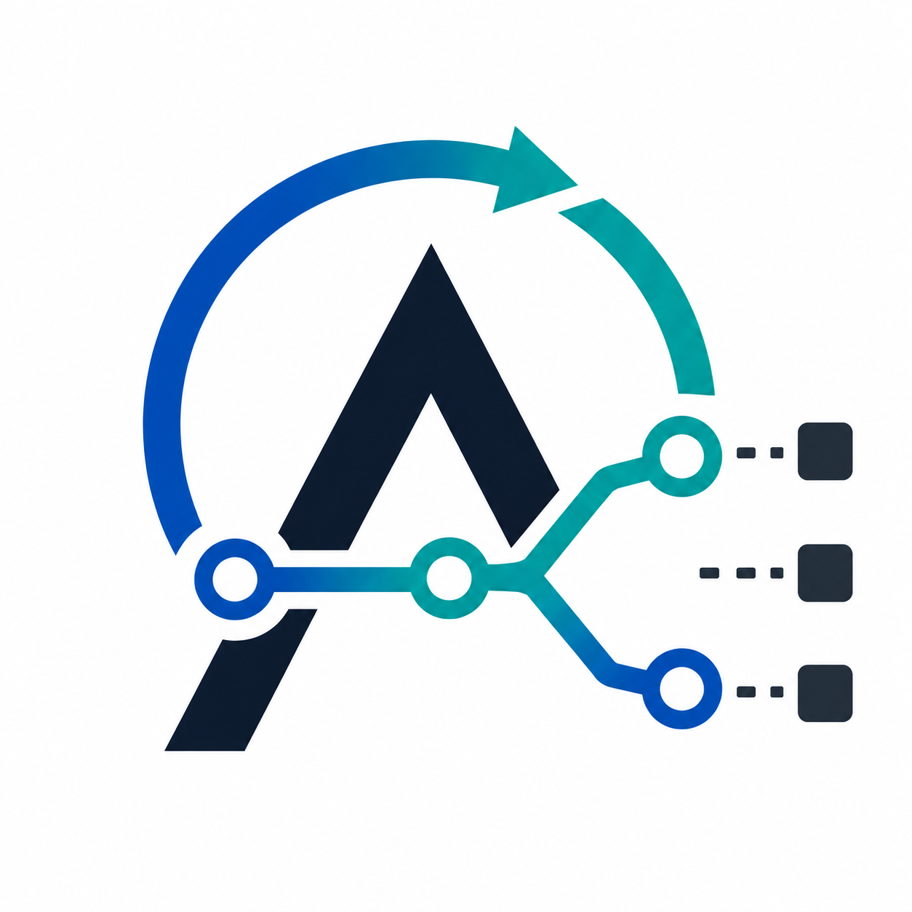
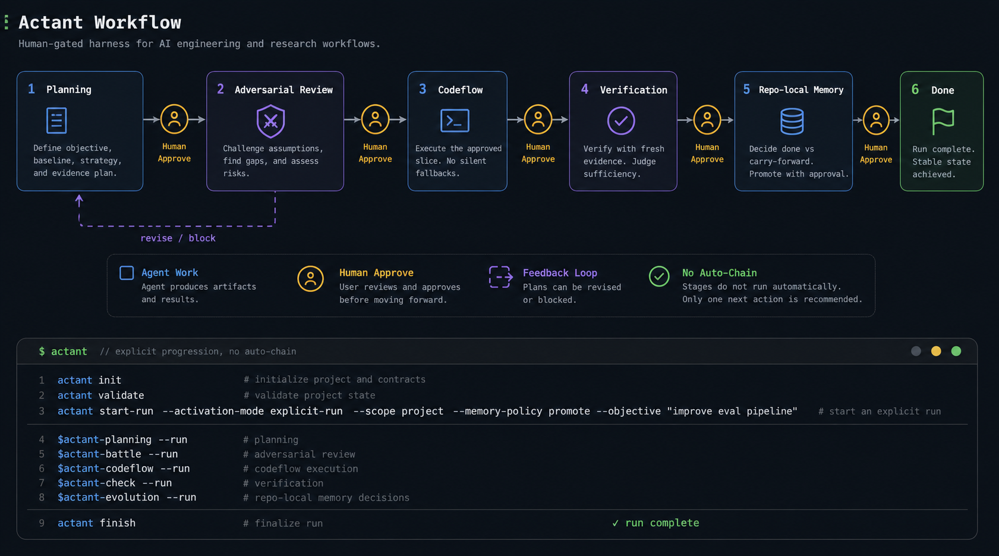

# Actant
<div align="center">
    
</div>


Actant is a research-driven, human-gated harness for AI engineering workflows. It turns open-ended agent work into explicit stages for planning, adversarial review, scoped implementation, verification, and repo-local memory decisions. It is not another automatic agent loop. Actant's main job is to keep intent, evidence, and long-term learning visible so humans can approve the important turns before the system writes code, claims success, or promotes memory.

`v0.6` is an alpha release. The current CLI is tested on Windows, and future releases will support more platforms.

## Why Actant

AI coding workflows often fail in quiet ways: the model guesses the user's intent, adds compatibility branches that hide real failures, spends tokens explaining around uncertainty, or carries stale assumptions into the next task. Actant makes those failure modes part of the workflow instead of leaving them implicit.

- Human approval is a first-class gate. Each stage recommends one next action, but Actant does not auto-chain the workflow. The user stays in control of scope, intent, and irreversible decisions.
- Research discipline is built into the harness. Plans can state hypotheses, baselines, evidence paths, non-goals, and verification strategy before implementation starts.
- Token use stays focused. Stage boundaries, local specs, task records, and scoped context reduce repeated rediscovery and keep agents from dragging an entire conversation into every step.
- Fallbacks are treated as risk, not convenience. Actant pushes codeflow away from silent fallbacks, swallowed errors, broad compatibility shims, and best-effort branches that can mask the real defect.
- Verification is separated from implementation. Completion claims should come from fresh evidence such as tests, CLI runs, static checks, artifact inspection, metrics, or small research runs.
- Memory is explicit and reviewable. Run-local notes can become durable project knowledge only through the evolution stage and only with human approval.
- The workflow fits real repositories. Specs, tasks, gate files, fallback audits, and run records live beside the code so future work can inspect the trail instead of reconstructing it from chat.

## How It Differs

Actant is not a generic prompt pack, a fully autonomous coding agent, or a heavyweight project manager. It is a harness around agent work: it constrains when context is loaded, when code is changed, when claims are verified, and when lessons are promoted.

Compared with a pure AI assistant, Actant trades some spontaneity for alignment and evidence. Compared with a traditional automation script, Actant keeps the judgment-heavy parts of research and engineering in the loop while still making the workflow machine-checkable enough to validate.

## Typical Use Case

Suppose a team wants to change retrieval ranking, inference behavior, or evaluation strategy inside an existing repository. With Actant, the work starts by making the objective falsifiable: define the baseline, the allowed code surface, the evidence path, and the criteria for success before implementation begins.

The plan is then challenged before codeflow starts, so the model does not immediately edit critical paths or hide uncertainty behind broad fallback behavior. During implementation, only the approved slice is executed. Check then verifies the result with fresh evidence such as tests, offline evaluation, small runs, CLI validation, or artifact inspection. If the result is weak, the next step is driven by evidence rather than by improvising around the failure.

That means the workflow is not "ask an agent to try something and hope it converges." It becomes a closed loop from research question, to approved implementation, to verification, to carry-forward or memory promotion.

## Workflow



Actant keeps stage transitions explicit. It does not auto-chain the workflow for you.

## Tools

### Core CLI

- `actant init` initializes repo-local Actant state.
- `actant validate` validates the local setup.
- `actant spec ...` manages repo-local specs and shared context.
- `actant start-run ...` starts an explicit persisted run.
- `actant finish` closes the current run.

### Stage Commands

- `$actant-planning` turns an objective into an explicit plan.
- `$actant-battle` runs the adversarial review before implementation.
- `$actant-codeflow` executes the approved slice.
- `$actant-check` verifies the result with fresh evidence.
- `$actant-evolution` decides done, carry-forward, and memory promotion.

### Supporting Commands

- `actant spec validate` checks the current spec state.
- `actant spec list` lists known specs and contexts.
- `actant task split` breaks a plan into tracked tasks.
- `actant task validate` checks task structure before execution.
- `actant fallback-audit scan ...` surfaces suspicious fallback patterns in the changed surface.

## Quick Start

```text
actant init
actant validate
actant start-run --activation-mode explicit-run --scope project --memory-policy promote --objective "demo run"
```

```text
$actant-planning --run
$actant-battle --run
$actant-codeflow --run
$actant-check --run
$actant-evolution --run
```

```text
actant finish
```

## Docs

- [Quickstart](docs/quickstart.md)
- [User manual](docs/actant-user-manual.md)

## Contact

If something looks wrong or unclear, open an issue or contact [me](mailto:actant@agent.qq.com).

## License

Apache-2.0. See [LICENSE](LICENSE).
